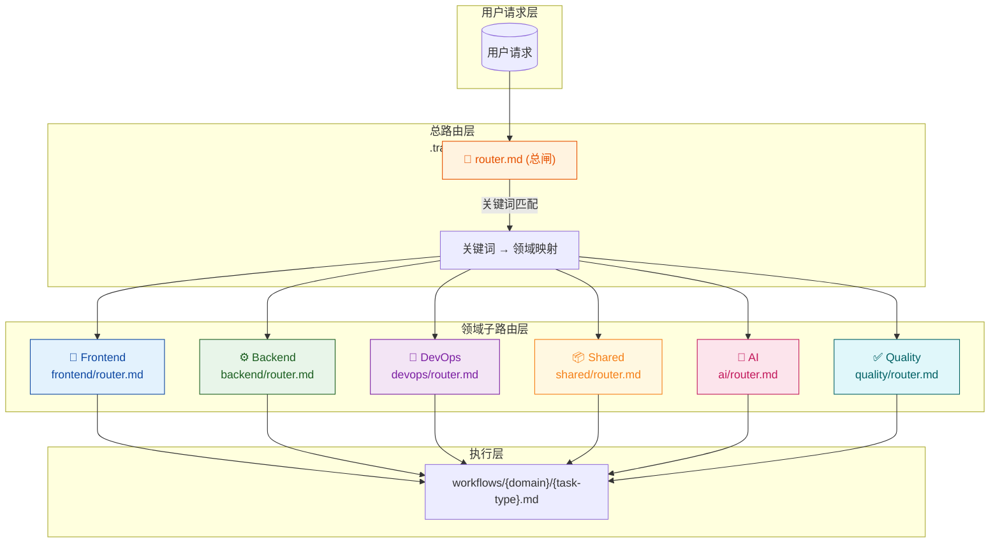
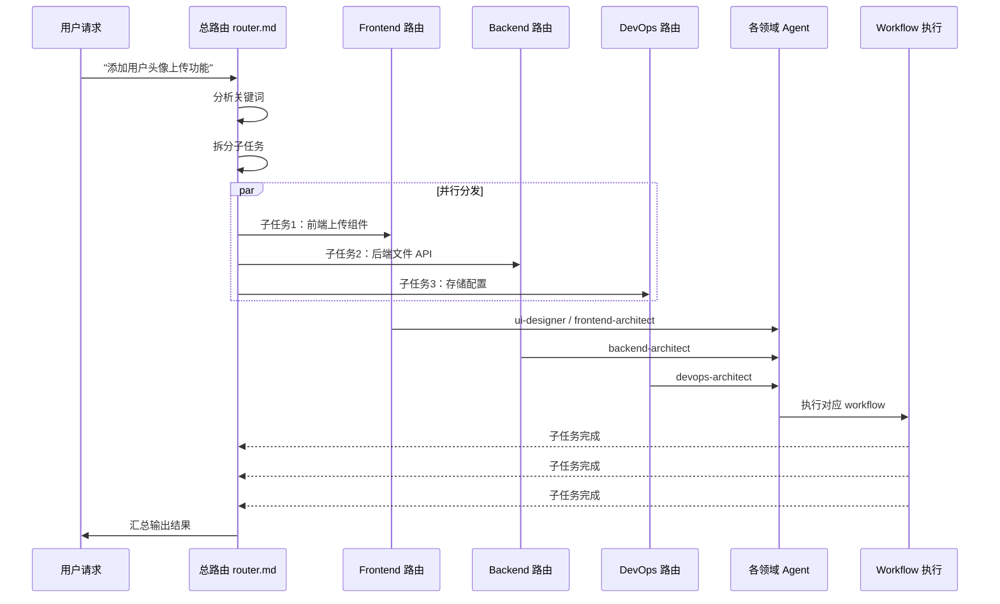

## 1. 高层摘要 (TL;DR)

- **影响范围**: 🟢 高 - 建立完整的任务路由架构，涉及 6 个技术领域的任务分发机制
- **关键变更**:
  - ✅ 新增总路由入口 `router.md`，实现基于关键词的智能任务分发
  - ✅ 新增 6 个领域子路由：Frontend、Backend、DevOps、Shared、AI、Quality
  - ✅ 定义每个领域的子任务分类、关键词映射、Agent 对应关系
  - ✅ 建立资源映射机制，按任务类型加载相应的文档和工具

---

## 2. 可视化架构图

### 2.1 路由系统整体架构

### 2.2 多领域任务处理流程

---

## 3. 详细变更分析

### 3.1 总路由系统 (`.trae/runtime/router.md`)

**功能定位**: 任务路由的总闸门，负责接收用户请求并分发到对应领域

**核心机制**:

| 组件         | 说明                                  |
| ------------ | ------------------------------------- |
| **入站处理** | 接收用户请求，提取关键词              |
| **领域映射** | 基于关键词匹配 6 个领域               |
| **任务拆分** | 支持多领域任务自动拆分                |
| **回退机制** | 无匹配时回退到 Subagent 或 SOLO Agent |

**领域分类规则**:

| 领域         | 覆盖路径         | 关键词示例                            |
| ------------ | ---------------- | ------------------------------------- |
| **Frontend** | `apps/frontend/` | 页面、组件、样式、布局、表单、动效    |
| **Backend**  | `apps/backend/`  | API、数据库、Auth、Controller、中间件 |
| **DevOps**   | CI/CD、部署配置  | CI/CD、Docker、环境变量、依赖、Husky  |
| **Shared**   | `packages/`      | 类型、Schema、翻译、Lint              |
| **AI**       | AI 模型集成      | AI、LLM、Chat、Embedding、RAG、Agent  |
| **Quality**  | 测试、审查、安全 | 单元测试、E2E、性能、安全、漏洞       |

---

### 3.2 Frontend 领域路由 (`.trae/runtime/frontend/router.md`)

**覆盖路径**: `apps/frontend/` 下所有文件

**子任务分类**:

| 任务类型     | 关键词                 | 对应 Agent         | 说明              |
| ------------ | ---------------------- | ------------------ | ----------------- |
| **create**   | 新建、创建、添加、开发 | ui-designer        | 从零创建组件/页面 |
| **modify**   | 修改、改、更新、调整   | frontend-architect | 修改已有功能      |
| **fix**      | 修复、Bug、报错、异常  | frontend-architect | 排查并修复问题    |
| **refactor** | 重构、优化、清理、提取 | frontend-architect | 代码重构          |
| **style**    | 样式、颜色、间距、排版 | ui-designer        | 纯视觉调整        |
| **i18n**     | 翻译、多语言、Locale   | frontend-architect | 文本/翻译相关     |

**通用资源加载**:

- `rules/frontend/styles.md` - 样式规范
- `rules/frontend/comments.md` - 注释规范
- `rules/frontend/frontend-types.md` - 类型定义规范
- `skill/nuxt-ui` - Nuxt UI 组件知识
- nuxt-ui MCP - 组件 API 查询

---

### 3.3 Backend 领域路由 (`.trae/runtime/backend/router.md`)

**覆盖路径**: `apps/backend/` 下所有文件

**子任务分类**:

| 任务类型     | 关键词                    | 对应 Agent        | 说明                     |
| ------------ | ------------------------- | ----------------- | ------------------------ |
| **create**   | 新建、创建、添加          | backend-architect | 新建模块/服务/Controller |
| **modify**   | 修改、改、更新            | backend-architect | 修改已有业务逻辑         |
| **fix**      | 修复、Bug、报错           | backend-architect | 排查后端问题             |
| **refactor** | 重构、优化、拆分          | backend-architect | 后端代码重构             |
| **api**      | 接口设计、端点、路由      | backend-architect | API 接口相关             |
| **data**     | 数据模型、实体、Migration | backend-architect | 数据库/实体相关          |

**通用资源加载**:

- `rules/project-architecture.md` - 项目架构概览
- `skill/supabase` - Supabase 使用指南
- `skill/supabase-postgres-best-practices` - Postgres 优化
- `skill/turborepo` - 构建配置
- supabase MCP - 查表结构、执行 SQL

**注意事项** ⚠️:

- 后端有统一的响应格式 `{code, data, msg}`（TransformInterceptor）
- 全局异常处理已由 AllExceptionsFilter 托管
- 所有 API 路由前缀为 `/api`

---

### 3.4 DevOps 领域路由 (`.trae/runtime/devops/router.md`)

**覆盖路径**: CI/CD、部署、项目基础设施配置

**子任务分类**:

| 任务类型   | 关键词                          | 对应 Agent       | 说明         |
| ---------- | ------------------------------- | ---------------- | ------------ |
| **ci**     | CI/CD、GitHub Actions、workflow | devops-architect | CI 流程配置  |
| **deploy** | 部署、发布、上线、Docker        | devops-architect | 部署相关     |
| **config** | 配置、环境变量、设置            | devops-architect | 项目配置变更 |
| **deps**   | 依赖、升级、版本、pnpm          | devops-architect | 依赖管理     |
| **hooks**  | Husky、lint-staged、Git hooks   | devops-architect | Git 钩子配置 |

**注意事项** ⚠️:

- 依赖升级必须在 `pnpm-workspace.yaml` 的 catalogs 中统一管理
- 不修改 Git 全局配置
- CI 配置变更后需验证 GitHub Actions 能正常触发

---

### 3.5 Shared 领域路由 (`.trae/runtime/shared/router.md`)

**覆盖路径**:

- `packages/types/` - 共享类型定义（Zod v4 schema）
- `packages/i18n/` - 国际化翻译文件
- `packages/lint-config/` - 共享 lint 配置

**子任务分类**:

| 任务类型        | 关键词                 | 对应 Agent         | 说明               |
| --------------- | ---------------------- | ------------------ | ------------------ |
| **types**       | 类型、Schema、Zod      | backend-architect  | 新增或修改共享类型 |
| **i18n**        | 翻译、Locale、新增语言 | frontend-architect | 翻译文件变更       |
| **lint**        | Lint、规则、配置       | devops-architect   | 共享 lint 配置变更 |
| **add-package** | 新建包、新增模块       | devops-architect   | 新增共享包         |

**注意事项** ⚠️:

- 所有跨模块共享类型必须放 `packages/types`，不在 apps/ 下重复定义
- 新增翻译需同步更新 4 处（翻译文件、index.ts、package.json、nuxt.config.ts）
- 变更后需验证各 app 能正常 lint

---

### 3.6 AI 领域路由 (`.trae/runtime/ai/router.md`)

**覆盖路径**: AI 模型集成、智能对话、embedding、Agent 编排

**子任务分类**:

| 任务类型      | 关键词                 | 对应 Agent              | 说明              |
| ------------- | ---------------------- | ----------------------- | ----------------- |
| **integrate** | 接入、集成、对接       | ai-integration-engineer | 接入 AI 模型/服务 |
| **chat**      | 对话、Chat、聊天       | ai-integration-engineer | 对话功能开发      |
| **rag**       | RAG、embedding、向量库 | ai-integration-engineer | 知识库/向量检索   |
| **agent**     | Agent、Tool、编排      | ai-integration-engineer | AI Agent 编排开发 |

**注意事项** ⚠️:

- 项目当前的 Supabase 实例没有启用 pgvector 扩展
- 前端已有 `RecentChatsCard.vue` 作为 AI 对话的 UI 占位
- AI 模型密钥必须通过环境变量管理，不可硬编码

---

### 3.7 Quality 领域路由 (`.trae/runtime/quality/router.md`)

**覆盖路径**: 测试、代码审查、性能审计、安全合规检查

**子任务分类**:

| 任务类型     | 关键词                        | 对应 Agent         | 说明           |
| ------------ | ----------------------------- | ------------------ | -------------- |
| **test**     | 测试、单元测试、E2E、集成测试 | api-test-pro       | 编写或运行测试 |
| **review**   | 审查、Review、审计、检查      | compliance-checker | 代码/合规审查  |
| **perf**     | 性能、优化、慢、瓶颈          | performance-expert | 性能分析和优化 |
| **security** | 安全、漏洞、风险              | compliance-checker | 安全审计       |
| **api-test** | API 测试、接口测试、负载      | api-test-pro       | 后端 API 测试  |

**注意事项** ⚠️:

- **测试**: 不破坏现有测试，新增测试需保证可通过
- **性能**: 优先用 Lighthouse 或 Clinic.js 等工具产数据
- **安全**: 不引入新的依赖，除非必要性验证过
- **api-test-pro**: 只测试不修改代码，不做 `Edit/Write` 操作

---

### 3.8 Workflow 调用路径汇总

| 领域         | Workflow 路径模式                   | 示例                                     |
| ------------ | ----------------------------------- | ---------------------------------------- |
| **Frontend** | `workflows/frontend/{task-type}.md` | `workflows/frontend/create-component.md` |
| **Backend**  | `workflows/backend/{task-type}.md`  | `workflows/backend/api.md`               |
| **DevOps**   | `workflows/devops/{task-type}.md`   | `workflows/devops/deploy.md`             |
| **Shared**   | `workflows/shared/{task-type}.md`   | `workflows/shared/types.md`              |
| **AI**       | `workflows/ai/{task-type}.md`       | `workflows/ai/chat.md`                   |
| **Quality**  | `workflows/quality/{task-type}.md`  | `workflows/quality/test.md`              |

---

## 4. 影响与风险评估

### 4.1 🔴 破坏性变更

无 - 本次变更为新增文件，未修改现有代码

### 4.2 ⚠️ 潜在风险

| 风险项                 | 风险等级 | 说明                                     | 缓解措施                                         |
| ---------------------- | -------- | ---------------------------------------- | ------------------------------------------------ |
| **路由配置错误**       | 中       | 关键词匹配不准确导致任务路由到错误领域   | 定期审查关键词映射表，添加测试用例验证路由准确性 |
| **资源路径不存在**     | 中       | 引用的规则文档或 workflow 文件可能不存在 | 确保所有引用路径有对应的文件存在                 |
| **Agent 对应关系变更** | 低       | 未来可能调整 Agent 职责导致路由失效      | 使用抽象的 Agent 角色名称，便于后续调整          |

### 4.3 ✅ 测试建议

1. **总路由测试**:
   - 验证各类关键词能正确路由到对应领域
   - 测试多领域任务拆分逻辑
   - 验证无匹配时的回退机制

2. **领域子路由测试**:
   - 验证每个领域的子任务分类完整
   - 检查资源映射路径是否存在
   - 测试 Workflow 路径生成逻辑

3. **集成测试**:
   - 模拟真实用户请求，验证端到端路由流程
   - 测试边界情况（如空请求、未知关键词）

---

## 5. 总结

本次变更建立了一个**完整的、分层级的任务路由系统**，实现了：

✅ **智能分发**: 基于关键词自动将任务路由到正确的技术领域  
✅ **领域隔离**: 每个领域有独立的路由、Agent、资源和 Workflow  
✅ **可扩展性**: 支持新增领域和任务类型，配置驱动  
✅ **多领域协作**: 支持复杂任务自动拆分和并行处理

这是一个基础架构层面的增强，为后续的 AI 辅助开发提供了清晰的任务分发和执行框架。
